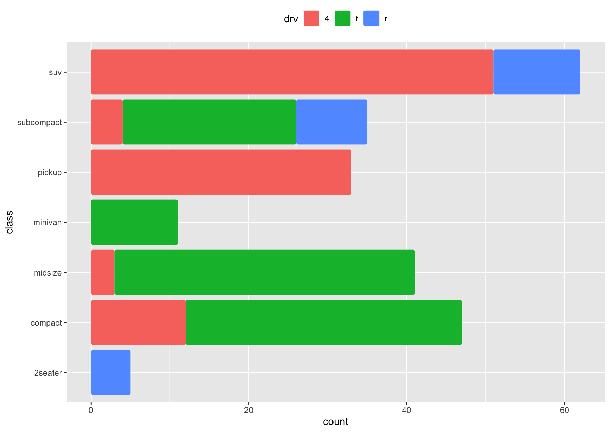
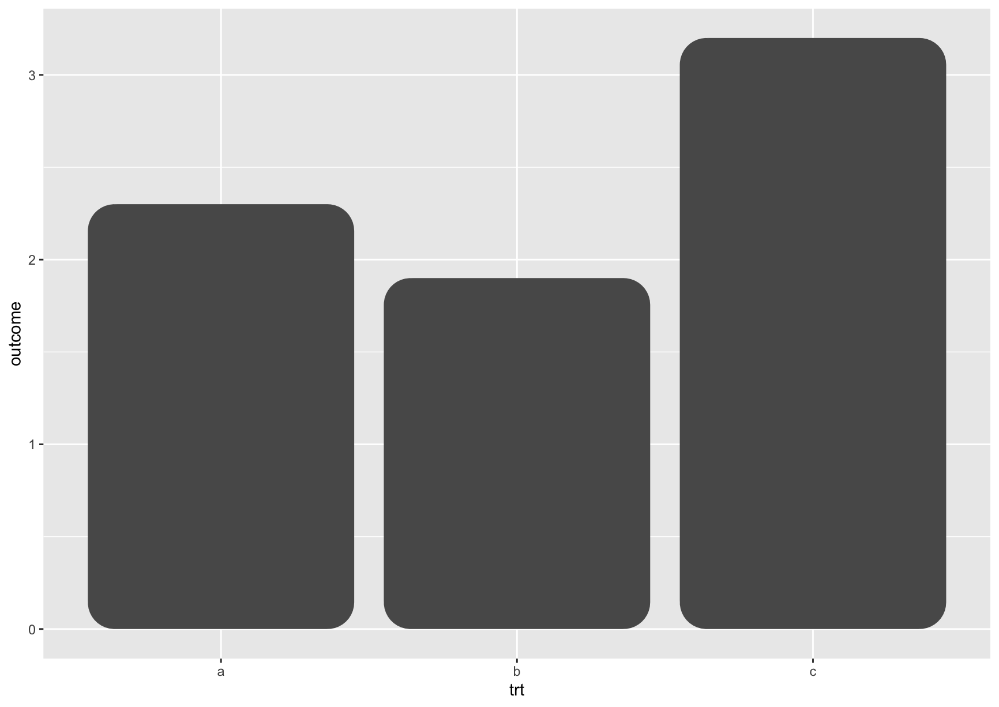
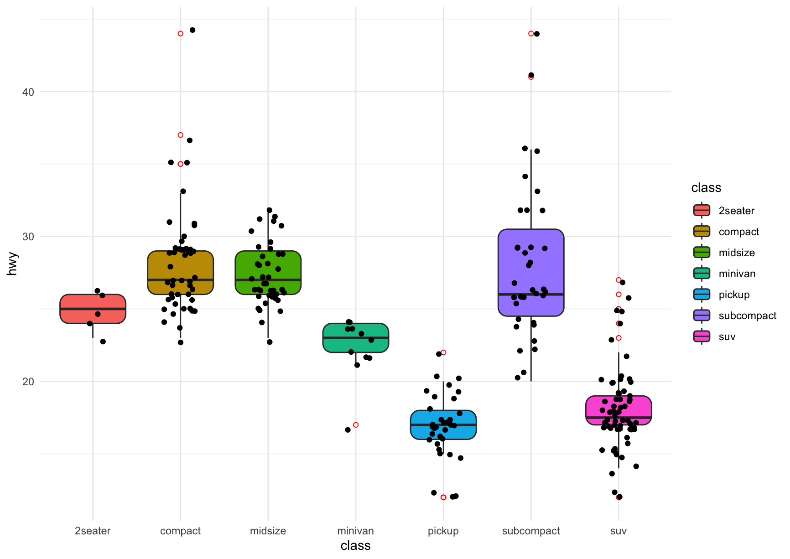
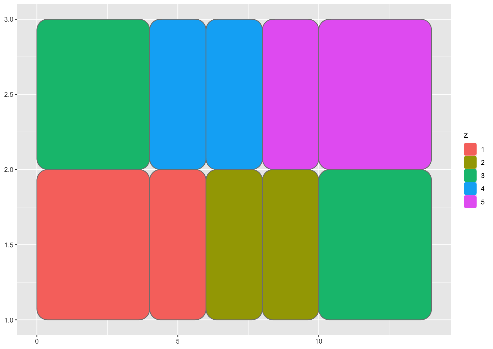
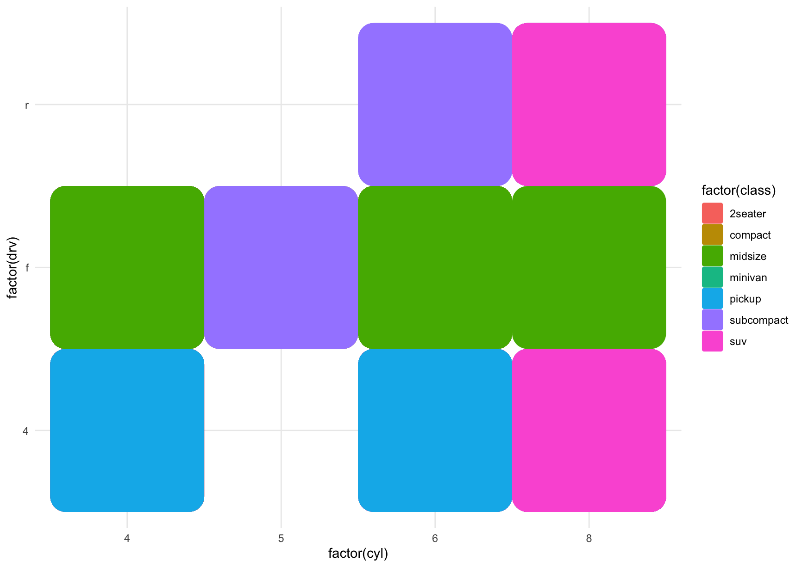
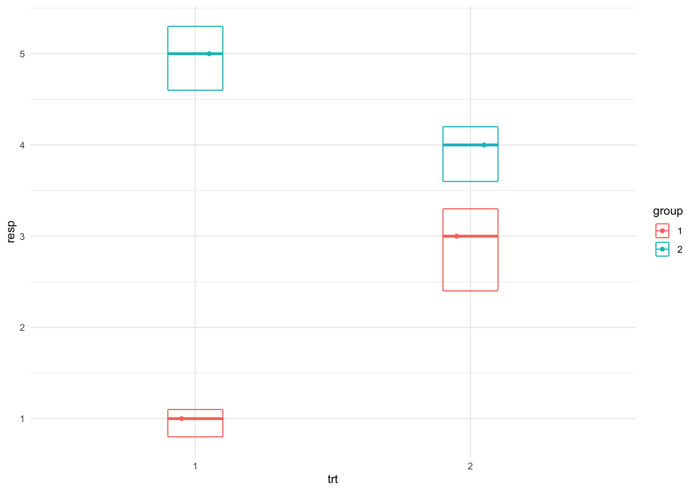
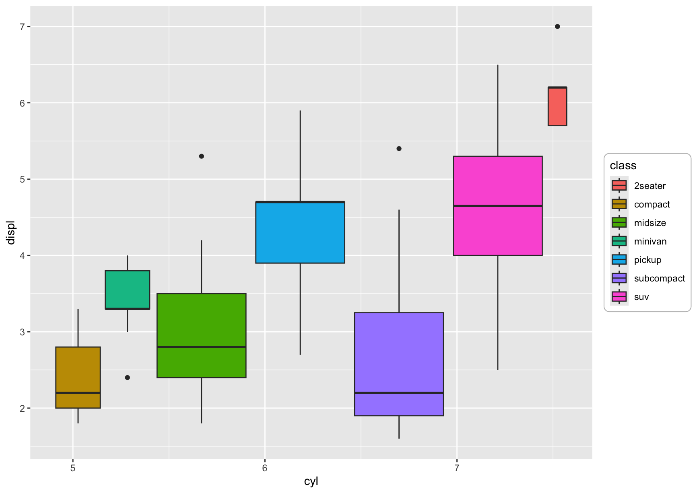

# gground 

**gground** is an extension package for `ggplot2` that is used to generate rounded-shaped graphics, 
such as rounded bar charts and box plots, to help users create more aesthetically pleasing and 
unique data visualization effects.

---

## Features

- Create rounded rectangle column charts and box plots.
- Perfectly integrated with `ggplot2`, supports customized graphic styles.
- Highly configurable parameters, suitable for various data visualization needs.

---

## Installation

You can install the released version of `gground` from [CRAN](https://CRAN.R-project.org) with:

And the development version from [GitHub](https://github.com/) with
```R
if (!require("devtools", quietly = TRUE))
  install.packages("devtools")

devtools::install_github("dxsbiocc/gground")
```

## Quick Start

`gground` provides various graphic functions that can seamlessly integrate with `ggplot2`, helping 
users create more beautiful and unique data visualization effects.

Here are some examples:
```R
library(ggplot2)
library(gground)
```

### 1. geom_round_bar

```R
ggplot(mpg, aes(y = class)) +
  geom_round_bar(aes(fill = drv), position = position_stack(reverse = TRUE)) +
  theme(legend.position = "top")
```


### 2. geom_round_col
```R
df <- data.frame(trt = c("a", "b", "c"), outcome = c(2.3, 1.9, 3.2))
ggplot(df, aes(trt, outcome)) +
  geom_round_col()
```


### 3. geom_round_boxplot
```R
p <- ggplot(mpg, aes(class, hwy))

p + geom_round_boxplot(aes(fill = class), outlier.colour = 'red', 
                       outlier.shape = 1, radius = unit(0.1, 'inches')) + 
  geom_jitter(width = 0.2) +
  theme_minimal()
```



### 4. geom_round_rect
```R
df <- data.frame(
  x = rep(c(2, 5, 7, 9, 12), 2),
  y = rep(c(1, 2), each = 5),
  z = factor(rep(1:5, each = 2)),
  w = rep(diff(c(0, 4, 6, 8, 10, 14)), 2)
)

ggplot(df, aes(xmin = x - w / 2, xmax = x + w / 2, ymin = y, ymax = y + 1)) +
  geom_round_rect(aes(fill = z), colour = "grey50", radius = unit(5, 'mm'))
```


### 5. geom_round_tile
```R
ggplot(mpg) +
  geom_round_tile(aes(x = factor(cyl), y = factor(drv), fill = factor(class)),
                  radius = unit(0.1, 'npc')) +
  theme_minimal()
```


### 6. geom_round_crossbar
```R
df <- data.frame(
  trt = factor(c(1, 1, 2, 2)),
  resp = c(1, 5, 3, 4),
  group = factor(c(1, 2, 1, 2)),
  upper = c(1.1, 5.3, 3.3, 4.2),
  lower = c(0.8, 4.6, 2.4, 3.6)
)
p <- ggplot(df, aes(trt, resp, colour = group))
p + geom_round_crossbar(aes(ymin = lower, ymax = upper), width = 0.2) +
  geom_point(position = position_dodge(width = 0.2)) +
  theme_minimal()
```


### 7. element_round_rect
```R
ggplot(mpg) +
  geom_boxplot(aes(x = cyl, y = displ, fill = class)) +
  theme(
    legend.background = element_round_rect(linewidth = 1, colour = "grey", radius = unit(5, 'pt'))
  )
```

